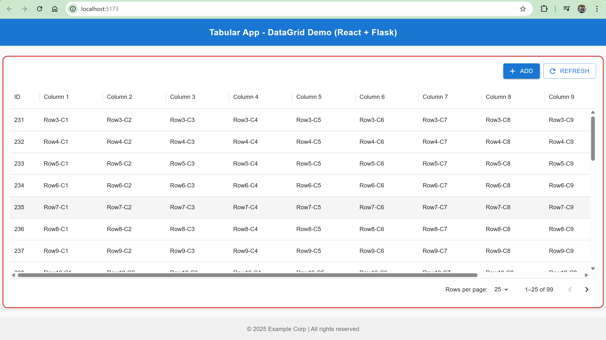
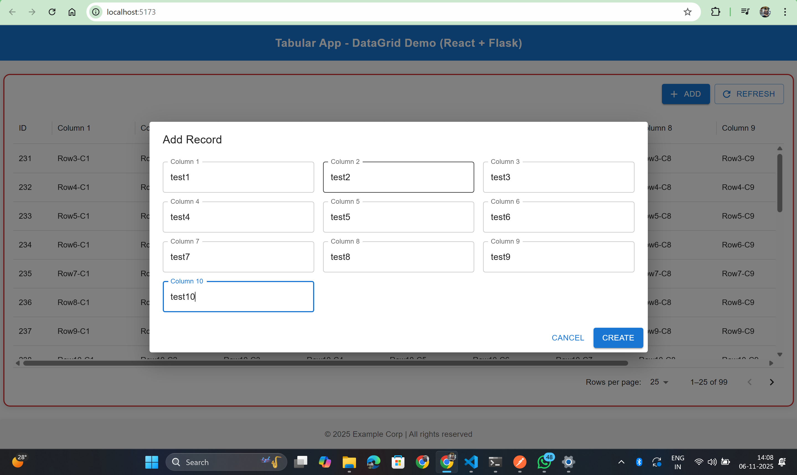
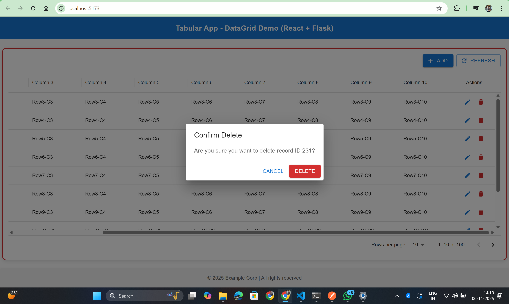

# 🧮Tabular-App: Three Tier CRUD App (React + Flask + MySQL)

This is a full-stack 3-tier web application built with:

- **Frontend:** React (Vite) + Material UI (MUI) + Axios + DataGrid
- **Backend:** Flask (Python) + SQLAlchemy + MySQL
- **Database:** MySQL (Workbench)

---

## ✨ Features

✅ Full CRUD operations (Create, Read, Update, Delete)  
✅ Material UI responsive DataGrid  
✅ Flask REST API returning JSON  
✅ Axios for data communication  
✅ Toast notifications using Snackbar  
✅ Centered responsive layout with fixed footer

---

## 📸 Screenshots

### 🏠 Home Page



### ➕ Add Record Modal



### ⚙️ Update Record Modal


### ⚙️ Delete Record Modal



---

---

## ⚙️ Setup Instructions

### 1. Clone the repository

```bash
git clone https://github.com/DipakSarmah/Tabular-App.git
cd TableApp
```

### 2. Backend Setup

```bash
cd backend
python -m venv venv
venv\Scripts\activate       # Windows or
source ./venv/Scripts/activate # bash
pip install -r requirements.txt
python app.py
```

### 3.Frontend Setup

```bash
cd ../frontend
npm install
npm run dev
```
